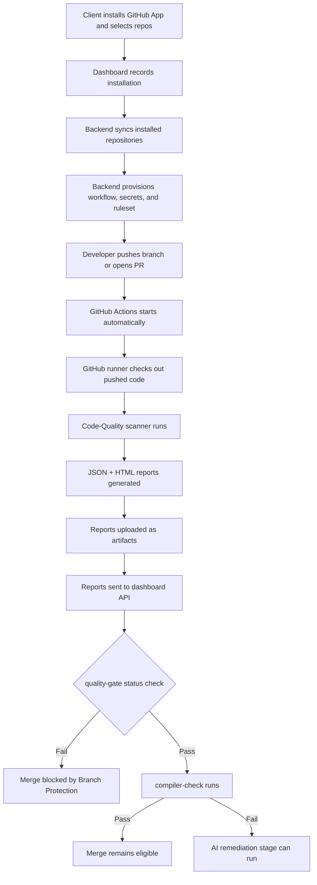

# Autonomous Quality Gate Integration Plan

This document explains how to integrate the existing `Code-Quality` project into
the combined `github-repo-intelligence` system, and how to leave clean extension
points for the compiler-error stage and AI remediation stage.

The goal is:

1. Run security, lint, dependency, SAST, file, and quality checks automatically
   after code is pushed or a pull request is opened.
2. If any blocking vulnerability exists, fail the GitHub Actions workflow and
   prevent merge into protected branches.
3. Always generate JSON and HTML reports, upload them as GitHub Actions
   artifacts, and send the report payload to the dashboard API.
4. If the quality gate passes, continue to compiler/build checks.
5. If compiler errors exist, send those errors and safe context to the AI
   remediation module.
6. Keep the whole flow autonomous, traceable, and easy for each teammate to plug
   into.

---

## Current project map

### `Code-Quality`

This is already the right foundation for your quality scanner.

Important files:

- `Code-Quality/src/cqpipeline/cli.py`
  - Provides `cq-pipeline scan`, `cq-pipeline install-hooks`, and report
    generation.
- `Code-Quality/src/cqpipeline/core/orchestrator.py`
  - Main pipeline engine. It loads config, discovers scanners, runs them in
    parallel, evaluates quality gates, and returns a `PipelineReport`.
- `Code-Quality/src/cqpipeline/git/hooks.py`
  - Installs `pre-commit` and `pre-push` hooks.
- `Code-Quality/src/cqpipeline/core/models.py`
  - Defines the important data contract: `Finding`, `ScanResult`,
    `GateResult`, and `PipelineReport`.
- `Code-Quality/config/pipeline.yaml`
  - Enables scanners for secrets, linting, SAST, dependencies, quality, files,
    and type checking.
- `Code-Quality/config/quality-gates.yaml`
  - Defines which findings fail the quality gate workflow.
- `Code-Quality/api/routers/scans.py`
  - Existing API for storing scan results, if you want a separate Code-Quality
    dashboard.

### `github-repo-intelligence`

This is the combined dashboard/orchestrator for the already merged metadata,
CI/CD, and dependency modules.

Important files:

- `github-repo-intelligence/server.py`
  - Main FastAPI app.
  - `run_single_analysis_stream()` currently launches metadata, CI/CD, and
    dependency workers in parallel.
  - `POST /api/analyze/full` streams the combined result to the UI.
- `github-repo-intelligence/core/models.py`
  - `AnalysisHistory` stores metadata, CI/CD, and dependency JSON payloads.
- `github-repo-intelligence/modules/metadata/`
  - Repository metadata extraction module.
- `github-repo-intelligence/modules/cicd/`
  - CI/CD analysis module.
- `github-repo-intelligence/modules/deps/`
  - Dependency health module.
- `github-repo-intelligence/modules/compiler/`
  - Future compiler/error check module.
- `github-repo-intelligence/modules/ai_remediation/`
  - Future AI remediation module.
- `github-repo-intelligence/markdowns/system.md`
  - Existing architecture explanation for the combined system.

---

## Important reality check

Final enforcement rule:

```text
Local pre-commit/pre-push hooks = optional developer convenience.
GitHub Actions + Branch Protection = mandatory company-level enforcement.
```

Local hooks are useful for early feedback, but they are not reliable enough to
be the main enforcement layer.

Why:

- Every developer must install the Code-Quality tool locally.
- Every developer must install the hook locally.
- Git `pre-commit` can abort a commit when it exits non-zero, but it can be
  bypassed with `--no-verify`.
- Git `pre-push` can abort a push when it exits non-zero, but local hooks still
  depend on contributors having the hook installed and not bypassing it.
- Local hooks do not create centralized audit trails or required GitHub status
  checks by themselves.

Therefore:

- Use local hooks only for faster local feedback.
- Use GitHub Actions as the production trigger.
- Use Branch Protection or Repository Rules with Required Status Checks to
  enforce company-level merge rules.

Important limitation:

GitHub Actions cannot block the first push to a feature branch. A developer can
still push a branch and trigger the workflow. Enforcement happens when that
branch is merged into protected branches such as `main` or `develop`.

Merge blocking is handled through:

- Branch Protection or Repository Rules.
- Required Status Checks.
- Required pull requests before merge.

For secret leakage specifically, also enable GitHub push protection if available.
It blocks supported secrets before they reach the repository.

References:

- [Git hooks documentation](https://git-scm.com/docs/githooks)
- [pre-commit hook stages](https://pre-commit.com/#confining-hooks-to-run-at-certain-stages)
- [GitHub protected branches](https://docs.github.com/en/repositories/configuring-branches-and-merges-in-your-repository/managing-protected-branches/about-protected-branches)
- [GitHub push protection](https://docs.github.com/en/code-security/concepts/secret-security/push-protection)

---

## Recommended target architecture

Keep `github-repo-intelligence` as the central orchestrator and dashboard.
Integrate `Code-Quality` as a fourth module named `quality`, but treat GitHub
Actions as the mandatory production execution environment.

Client-facing autonomy rule:

- Clients should only sign in with GitHub, install/authorize the GitHub App, and
  select repositories.
- Clients should not configure GitHub App permissions, private keys, webhook
  URLs, workflow files, GitHub Actions secrets, or branch rules by hand.
- GitHub App permissions/private key/webhook setup is a one-time Arya Tech
  platform-owner responsibility.
- After installation, the backend should sync selected repositories and
  provision workflow, repository secrets, and branch rules automatically.
- Local ngrok/cloudflared tunnels are platform-team development tools only; in
  production, `PUBLIC_BASE_URL` must be the deployed dashboard HTTPS URL.

- Optional local developer mode:
  - Runs on the contributor's machine.
  - Scans unpushed code from the local filesystem.
  - Gives early feedback before commit or push.
  - Can be bypassed and must not be treated as the company enforcement layer.
  - Saves JSON and HTML reports.

- Production GitHub Actions mode:
  - Runs automatically after push or pull request events.
  - Uses a GitHub runner to check out the exact pushed code.
  - Runs the Code-Quality scanner.
  - Generates JSON and HTML reports.
  - Uploads reports as GitHub Actions artifacts.
  - Sends report data to the dashboard API.
  - Fails or passes the workflow.
  - Controls merge eligibility through Required Status Checks.

- Dashboard mode:
  - Receives reports from GitHub Actions.
  - Stores quality results beside metadata, CI/CD, and dependency results.
  - Displays the full workflow state.
  - Provides a shared place for compiler-stage and AI-remediation outputs.

High-level flow:



---

## Best integration approach

Do not copy all Code-Quality code into `github-repo-intelligence`. Treat
`Code-Quality` as a reusable Python package.

Do not rely on `sys.path.insert(...)` dependency hacks. They break easily in
Docker, CI, and deployed environments because imports depend on the current file
layout and process working directory.

For local development, install it into the same virtual environment:

```bash
cd github-repo-intelligence
pip install -e ../Code-Quality[all]
```

For a more stable team setup, add one of these:

```text
# requirements.txt option for local prototype
-e ../Code-Quality
```

or publish `cq-pipeline` as an internal package later.

Use one clear packaging strategy:

- Prototype:
  - `pip install -e ../Code-Quality[all]`
- Production:
  - Publish Code-Quality as an internal Python package, or
  - Move `cqpipeline` into `packages/cqpipeline` inside a monorepo and install
    it as a package.

Document the selected package source in the reusable GitHub Actions workflow so
every monitored repo uses the same scanner version.

Do not put GitHub tokens in clone URLs.

Avoid:

```text
https://TOKEN@github.com/owner/repo.git
```

Preferred:

- In GitHub Actions, use `actions/checkout@v4`.
- For server-side fetching, use the GitHub API with `Authorization` headers.
- If clone is unavoidable, use a safe credential helper or GitHub App token.

---

## Report API security

Report-ingestion endpoints are security-sensitive. They decide what the
dashboard stores and what the company sees as the latest pipeline state.

### GitHub webhook authentication

For GitHub webhooks:

- Verify `X-Hub-Signature-256`.
- Use `WEBHOOK_SECRET` from `.env`.
- Reject invalid signatures with `401`.
- Reject missing signatures with `401`.

### GitHub Actions report authentication

For GitHub Actions report POST requests:

- Use `Authorization: Bearer $DASHBOARD_API_KEY`.
- Store `DASHBOARD_API_KEY` as a GitHub Secret in the monitored repos or
  organization.
- Reject missing or wrong API keys with `401`.

### Additional protections

Add all of these to report ingestion:

- Repo allowlist.
- Payload size limit.
- Rate limiting.
- Duplicate handling with the idempotency key.
- Secret redaction before storage.

### Repo allowlist

Dashboard should reject reports from unknown repos unless demo mode is enabled.

Recommended config:

```text
ALLOW_UNREGISTERED_REPOS=false
```

Use the `monitored_repositories` table for allowed repos. If
`ALLOW_UNREGISTERED_REPOS=false` and a report arrives for a repo that is not in
`monitored_repositories` or is inactive, reject it.

Demo mode can relax this, but production must not.

---

## Secret redaction and sanitizer

Secret values must never be sent raw to:

- Dashboard database.
- UI reports.
- AI remediation module.
- External AI APIs.
- Logs.

Add this module to the plan:

```text
github-repo-intelligence/modules/security/
  __init__.py
  sanitizer.py
```

Required sanitizer behavior:

```text
actual_secret_value -> [REDACTED]
```

For secret findings, keep only:

- File path.
- Line number.
- Rule ID.
- Secret type.
- Scanner name.
- Recommendation.

Hard rule:

AI remediation never receives raw secret values.

For secret findings, AI should only suggest:

- Remove the secret.
- Use an environment variable.
- Rotate or revoke the leaked credential.

Apply sanitization before:

- Writing `raw_json` to `pipeline_runs`.
- Writing `raw_json` to `pipeline_stages`.
- Creating `quality_findings`.
- Rendering UI reports.
- Logging request payloads.
- Sending context to the AI remediation module.

---

## Add a quality module to the combined system

Create this folder:

```text
github-repo-intelligence/modules/quality/
  __init__.py
  report_receiver.py
  routes.py
  schemas.py
  normalizer.py
```

### `report_receiver.py`

Responsibility:

- Accept quality reports submitted by GitHub Actions.
- Validate the dashboard API token.
- Normalize the Code-Quality JSON payload.
- Store the quality result with repository, branch, commit SHA, workflow run ID,
  and job status.
- Return a normalized stage result to the dashboard/workflow system.

The dashboard should not be the mandatory production scanner. In production,
GitHub Actions runs the scanner and sends the output to the dashboard.

Optional local/manual scan endpoints can exist for demos, but they must not be
the enforcement model.

### `normalizer.py`

Convert `PipelineReport` into a common stage format that the compiler and AI
remediation modules can also use.

Large repositories can produce too many findings for dashboard payloads. Add
this config:

```text
MAX_FINDINGS_PER_REPORT=500
```

Rules:

- Store summary counts for all findings.
- Sort findings by severity before truncating.
- Send/store only the top N findings in dashboard payloads.
- Keep the full report as a GitHub Actions artifact.
- Dashboard should show: "Showing top 500 findings; download full artifact for
  complete report."

```python
def normalize_quality_report(report, json_path, html_path) -> dict:
    findings = sorted(report.all_findings, key=lambda f: f.severity.weight, reverse=True)
    visible_findings = findings[:MAX_FINDINGS_PER_REPORT]

    return {
        "stage": "quality_gate",
        "status": "passed" if report.verdict.value in ("pass", "warn") else "failed",
        "blocking": report.verdict.value in ("fail", "error"),
        "verdict": report.verdict.value,
        "summary": {
            "total_findings": report.total_findings,
            "critical": report.critical_count,
            "high": report.high_count,
            "medium": report.medium_count,
            "low": report.low_count,
            "files_scanned": report.files_scanned,
            "duration_seconds": report.duration_seconds,
        },
        "blocking_reasons": report.blocking_reasons,
        "artifacts": {
            "json_report": str(json_path),
            "html_report": str(html_path),
        },
        "findings": [finding.model_dump(mode="json") for finding in visible_findings],
        "git": {
            "commit_sha": report.commit_sha,
            "branch": report.branch,
            "author": report.author,
            "repository": report.repository,
        },
    }
```

### `routes.py`

Expose report-ingestion endpoints in the combined dashboard. In production, the
dashboard receives reports from GitHub Actions; it does not scan local folders
itself.

Production endpoints:

```text
POST /api/quality/report
POST /api/pipeline/report
GET  /api/pipeline/runs
GET  /api/pipeline/runs/{id}
GET  /api/pipeline/latest/{owner}/{repo}
```

All production report POST endpoints must enforce authentication, repo
allowlisting, payload size limits, rate limiting, duplicate handling, and secret
redaction before storage.

Implementation rule:

The `/api/quality/report` endpoint must not be merged unless authentication,
repo allowlist validation, and secret redaction are implemented in the same
change. Do not create the endpoint unsecured and secure it later.

Endpoint responsibilities:

- `POST /api/quality/report`
  - Receives a Code-Quality JSON report from GitHub Actions.
  - Stores the quality-gate result for a repo, branch, commit SHA, and workflow
    run.
- `POST /api/pipeline/report`
  - Receives normalized stage reports for quality, compiler, AI remediation,
    and final verification.
  - Updates the overall autonomous pipeline run.
- `GET /api/pipeline/runs`
  - Lists pipeline runs across all monitored repositories.
- `GET /api/pipeline/runs/{id}`
  - Shows full details for one pipeline run.
- `GET /api/pipeline/latest/{owner}/{repo}`
  - Returns the latest pipeline status for one monitored repository.

### Exact `/api/quality/report` payload schema

Endpoint:

```text
POST /api/quality/report
```

Headers:

```text
Content-Type: application/json
Authorization: Bearer <DASHBOARD_API_KEY>
```

Payload:

```json
{
  "repo": "owner/repo",
  "branch": "feature/security-gate",
  "commit_sha": "abc123",
  "pr_number": 12,
  "workflow_run_id": "123456789",
  "workflow_url": "https://github.com/owner/repo/actions/runs/123456789",
  "stage": "quality_gate",
  "status_check": "quality-gate",
  "verdict": "fail",
  "status": "failed",
  "blocking": true,
  "started_at": "2026-06-15T10:00:00Z",
  "finished_at": "2026-06-15T10:00:30Z",
  "summary": {
    "total_findings": 5,
    "critical": 1,
    "high": 2,
    "medium": 2,
    "low": 0,
    "files_scanned": 21,
    "duration_seconds": 30
  },
  "findings": [],
  "artifacts": {
    "json_report": "quality-report.json",
    "html_report": "quality-report.html",
    "github_artifact": "quality-report"
  },
  "raw_report": {}
}
```

Pydantic schema to use during implementation:

```python
from typing import Any, Literal
from pydantic import BaseModel, Field


class QualitySummary(BaseModel):
    total_findings: int = 0
    critical: int = 0
    high: int = 0
    medium: int = 0
    low: int = 0
    files_scanned: int = 0
    duration_seconds: float = 0.0


class QualityArtifactLinks(BaseModel):
    json_report: str | None = None
    html_report: str | None = None
    github_artifact: str | None = None


class QualityFinding(BaseModel):
    scanner: str | None = None
    severity: str | None = None
    rule_id: str | None = None
    title: str | None = None
    message: str | None = None
    file_path: str | None = None
    line_number: int | None = None
    recommendation: str | None = None


class QualityReportPayload(BaseModel):
    repo: str = Field(..., examples=["owner/repo"])
    branch: str
    commit_sha: str
    pr_number: int | None = None
    workflow_run_id: str
    workflow_url: str | None = None

    stage: Literal["quality_gate"] = "quality_gate"
    status_check: str = "quality-gate"

    verdict: Literal["pass", "warn", "fail", "error"]
    status: Literal["passed", "failed", "blocked", "error"]
    blocking: bool

    started_at: str | None = None
    finished_at: str | None = None

    summary: QualitySummary = Field(default_factory=QualitySummary)
    findings: list[QualityFinding] = Field(default_factory=list)
    artifacts: QualityArtifactLinks = Field(default_factory=QualityArtifactLinks)

    raw_report: dict[str, Any] = Field(default_factory=dict)
```

The GitHub Action should wrap the scanner output with GitHub metadata before
sending it to the dashboard. `quality-report.json` from the scanner may not
contain enough GitHub context by itself.

Required metadata:

```text
repo
branch
commit_sha
workflow_run_id
workflow_url
pr_number if available
stage
status_check
```

### Local development/demo endpoint

If you keep this endpoint, it must be clearly marked as local development or
demo-only:

```text
POST /api/quality/local-scan
```

Example local-only request:

```json
{
  "project_root": "C:/path/to/local/repo"
}
```

This endpoint is not production-safe and must not be used as the company
enforcement model.

Why it is not production-safe:

- It only works when FastAPI runs on the same laptop as the code.
- It will not work on deployed servers such as Docker, Render, Railway, AWS, or
  similar environments unless the repository files are mounted into the server.
- Accepting arbitrary local file paths through an API is a security risk.
- It does not create GitHub Required Status Checks.
- It cannot enforce merge eligibility across multiple repositories.

Use it only for demos, debugging, or local development. Production must use:

```text
GitHub Actions checks out code
        |
        v
runs Code-Quality scanner
        |
        v
generates JSON report
        |
        v
POSTs report to dashboard
```

Then update `server.py`:

```python
from modules.quality.routes import router as quality_router

app.include_router(quality_router)
```

---

## Database design

Do not dump new autonomous pipeline fields into `AnalysisHistory`.

Keep `AnalysisHistory` only for existing repository intelligence history:

- `metadata_json`
- `cicd_json`
- `dependencies_json`

Do not add these directly into `AnalysisHistory`:

- `quality_json`
- `compiler_json`
- `ai_fix_json`
- `workflow_status`
- `workflow_id`
- `head_sha`
- `branch`

Reason:

Repository intelligence history and pipeline execution history are different
concerns. `AnalysisHistory` answers "what does this repository look like over
time?" Pipeline tables answer "what happened during this validation run?"

Add separate pipeline tables.

### `pipeline_runs`

Stores one autonomous pipeline execution for a repo/branch/commit/workflow run.

Suggested columns:

- `id`
- `repo`
- `branch`
- `commit_sha`
- `pr_number`
- `workflow_run_id`
- `overall_status`
- `started_at`
- `completed_at`
- `created_at`
- `raw_json`

Unique constraint:

```text
repo + commit_sha + workflow_run_id
```

### `pipeline_stages`

Stores one stage result inside a pipeline run.

Suggested columns:

- `id`
- `pipeline_run_id`
- `stage_name`
- `status`
- `blocking`
- `started_at`
- `completed_at`
- `duration_ms`
- `summary_json`
- `artifacts_json`
- `raw_json`

Unique constraint:

```text
pipeline_run_id + stage_name
```

### `quality_findings`

Stores normalized quality findings for search, filtering, and UI tables.

Suggested columns:

- `id`
- `pipeline_stage_id`
- `scanner`
- `severity`
- `rule_id`
- `title`
- `message`
- `file_path`
- `line_number`
- `recommendation`
- `created_at`

### `monitored_repositories`

Stores the repositories the dashboard is allowed to accept reports from.

Suggested columns:

- `id`
- `full_name`
- `owner`
- `repo`
- `is_active`
- `created_at`

Migration strategy:

For a quick local MVP:

- `Base.metadata.create_all(bind=engine)` can create new tables if the database
  is fresh.
- Do not rely on `create_all` for changing existing schemas.

For proper implementation:

- Use Alembic versioned migrations for `pipeline_runs`, `pipeline_stages`,
  `quality_findings`, and `monitored_repositories`.
- Avoid adding more manual column-addition hacks.

Before implementation, inspect the current database setup. If Alembic is already
configured, use Alembic. If not, add Alembic or clearly document MVP-only
`create_all` behavior.

Preferred migration location:

```text
github-repo-intelligence/alembic/versions/
```

The dashboard should query `pipeline_runs`, `pipeline_stages`, and
`quality_findings` for Pipeline Monitor views, while `AnalysisHistory` continues
to serve the existing repository intelligence history.

---

## Use a common stage result contract

This is the most important integration decision. Every stage must return the
same outer JSON format.

```json
{
  "stage": "quality_gate",
  "status": "passed",
  "blocking": false,
  "repo": "owner/repo",
  "branch": "feature/test",
  "commit_sha": "abc123",
  "pr_number": 12,
  "started_at": "2026-06-15T10:00:00Z",
  "finished_at": "2026-06-15T10:00:10Z",
  "duration_ms": 10000,
  "summary": {},
  "findings": [],
  "artifacts": {},
  "next_stage": "compiler_check",
  "errors": []
}
```

Use these stage names:

```text
quality_gate
compiler_check
ai_remediation
final_verification
repo_intelligence
```

Use these statuses:

```text
pending
running
passed
failed
blocked
error
skipped
needs_human
```

Rules:

- `blocking = true` means the workflow must not continue automatically.
- `quality_gate.failed` means the workflow fails and merge into protected
  branches is blocked.
- `quality_gate.passed` means the workflow can continue to `compiler_check`.
- `compiler_check.failed` means call the AI remediation module.
- `ai_remediation.passed` means a patch or PR was produced, then the system
  loops back to quality and compiler checks.
- Secret findings must never be sent raw to an AI model. Redact the secret value
  and tell the user to rotate the credential.

---

## Idempotency and duplicate handling

GitHub events can repeat. GitHub Actions jobs can be re-run. Network retries can
also submit the same report more than once.

Use this unique key for stage reports:

```text
repo + commit_sha + workflow_run_id + stage_name
```

Map that external report key to database constraints:

```text
pipeline_runs unique: repo + commit_sha + workflow_run_id
pipeline_stages unique: pipeline_run_id + stage_name
```

If a duplicate report arrives:

- Do not create duplicate rows.
- Find or update the existing `pipeline_runs` row by
  `repo + commit_sha + workflow_run_id`.
- Find the existing `pipeline_stages` row by the unique key.
- Update the existing row with the newest status, timestamps, summary,
  artifacts, and raw JSON.
- Recompute the parent `pipeline_runs.overall_status`.
- Replace or upsert related `quality_findings` for that stage.
- Treat duplicate ingestion as an update operation, not an insert operation.

This prevents duplicate dashboard rows when GitHub replays events or when a
workflow is re-run.

---

## Optional local hooks

Local pre-commit and pre-push hooks are optional developer convenience only.
They are helpful because they can show problems before a developer opens a pull
request, but they are not reliable as the main enforcement model.

Local hooks are not reliable for mandatory enforcement because:

- Every developer must install the Code-Quality tool.
- Every developer must install the hook.
- Hooks can be bypassed with `--no-verify`.
- Hooks only run on the developer's machine.
- Hooks do not create required GitHub status checks.

Use local hooks for early local feedback only:

```text
developer changes code
  -> optional local hook runs
  -> developer sees fast feedback
  -> developer still pushes branch or opens PR
  -> GitHub Actions performs mandatory enforcement
```

The local hook can still run:

```bash
cq-pipeline scan --all --format all
```

But the final authority must be the GitHub Actions workflow and protected branch
rules.

References:

- [pre-commit stages and hook installation](https://pre-commit.com/#confining-hooks-to-run-at-certain-stages)
- [Gitleaks pre-commit usage](https://github.com/gitleaks/gitleaks#pre-commit)
- [pip-audit pre-commit and JSON output](https://github.com/pypa/pip-audit)

---

## Production trigger flow

The production trigger must be GitHub Actions.

Correct production flow:

```text
Developer pushes branch or opens PR
        |
        v
GitHub Actions starts automatically
        |
        v
GitHub runner checks out pushed code
        |
        v
Code-Quality scanner runs
        |
        v
JSON + HTML reports are generated
        |
        v
Reports uploaded as artifacts
        |
        v
Reports sent to dashboard API
        |
        v
Workflow pass/fail controls merge eligibility
```

The dashboard API must receive reports from GitHub Actions, not by scanning
arbitrary local file paths from a deployed server:

```text
GitHub Actions checks out code
        |
        v
runs Code-Quality scanner
        |
        v
generates JSON report
        |
        v
POSTs report to dashboard
```

Important:

- GitHub Actions cannot block the first push to a feature branch.
- It can fail the workflow after that push.
- Merge into protected branches is blocked through Branch Protection or
  Repository Rules.
- Required Status Checks are the mechanism that makes failed workflows block
  merges.
- The `quality-gate` job must finish report generation and dashboard submission
  before the final failing step exits non-zero.

---

## GitHub Actions workflow

Use this workflow for one standalone repository. For the company multi-repo
system, prefer the reusable workflow design in the next section.

The standalone workflow is for learning, first testing, and one-repo
proof-of-concept only. The reusable workflow is the long-term source of truth.
After the reusable workflow is working, do not maintain two separate full
workflow files because they will drift.

```yaml
name: Repository Quality Pipeline

on:
  push:
    branches: [main, develop, "feature/**"]
  pull_request:
    branches: [main, develop]

permissions:
  contents: read
  pull-requests: write
  checks: write
  actions: read

jobs:
  quality-gate:
    name: quality-gate
    runs-on: ubuntu-latest

    steps:
      - name: Checkout pushed code
        uses: actions/checkout@v4
        with:
          fetch-depth: 0

      - name: Set up Python
        uses: actions/setup-python@v5
        with:
          python-version: "3.11"

      - name: Install Code Quality Tool
        run: |
          python -m pip install --upgrade pip
          pip install -e ./Code-Quality[all]

      - name: Run Code Quality Scan
        run: |
          set +e
          cq-pipeline scan --all --format all
          SCAN_EXIT=$?
          set -e
          echo "SCAN_EXIT=$SCAN_EXIT" >> $GITHUB_ENV

      - name: Normalize report filenames
        if: always()
        run: |
          mkdir -p reports

          JSON_REPORT="$(ls -t reports/*.json 2>/dev/null | head -n 1 || true)"
          HTML_REPORT="$(ls -t reports/*.html 2>/dev/null | head -n 1 || true)"

          if [ -n "$JSON_REPORT" ]; then
            cp "$JSON_REPORT" reports/quality-report.json
          else
            echo '{"verdict":"error","error":"No JSON report generated"}' > reports/quality-report.json
          fi

          if [ -n "$HTML_REPORT" ]; then
            cp "$HTML_REPORT" reports/quality-report.html
          else
            echo "<html><body><h1>No HTML report generated</h1></body></html>" > reports/quality-report.html
          fi

      - name: Ensure jq is available
        if: always()
        run: |
          if ! command -v jq >/dev/null 2>&1; then
            echo "::warning::jq is not installed. Install jq or replace payload generation with Python."
            exit 1
          fi

      - name: Create dashboard payload
        if: always()
        env:
          REPO: ${{ github.repository }}
          BRANCH: ${{ github.head_ref || github.ref_name }}
          COMMIT_SHA: ${{ github.sha }}
          WORKFLOW_RUN_ID: ${{ github.run_id }}
          WORKFLOW_URL: https://github.com/${{ github.repository }}/actions/runs/${{ github.run_id }}
          PR_NUMBER: ${{ github.event.pull_request.number }}
        run: |
          STATUS="passed"
          VERDICT="pass"
          BLOCKING=false
          if [ "${SCAN_EXIT:-1}" != "0" ]; then
            STATUS="failed"
            VERDICT="fail"
            BLOCKING=true
          fi

          jq -n \
            --arg repo "$REPO" \
            --arg branch "$BRANCH" \
            --arg commit_sha "$COMMIT_SHA" \
            --arg workflow_run_id "$WORKFLOW_RUN_ID" \
            --arg workflow_url "$WORKFLOW_URL" \
            --arg pr_number "$PR_NUMBER" \
            --arg stage "quality_gate" \
            --arg status_check "quality-gate" \
            --arg verdict "$VERDICT" \
            --arg status "$STATUS" \
            --argjson blocking "$BLOCKING" \
            --slurpfile raw reports/quality-report.json \
            '{
              repo: $repo,
              branch: $branch,
              commit_sha: $commit_sha,
              pr_number: (if $pr_number == "" then null else ($pr_number | tonumber) end),
              workflow_run_id: $workflow_run_id,
              workflow_url: $workflow_url,
              stage: $stage,
              status_check: $status_check,
              verdict: $verdict,
              status: $status,
              blocking: $blocking,
              summary: {
                total_findings: (($raw[0].total_findings // 0)),
                critical: (($raw[0].critical_count // 0)),
                high: (($raw[0].high_count // 0)),
                medium: (($raw[0].medium_count // 0)),
                low: (($raw[0].low_count // 0)),
                files_scanned: (($raw[0].files_scanned // 0)),
                duration_seconds: (($raw[0].duration_seconds // 0))
              },
              findings: (($raw[0].findings // [])),
              artifacts: {
                json_report: "quality-report.json",
                html_report: "quality-report.html",
                github_artifact: "quality-report"
              },
              raw_report: ($raw[0] // {})
            }' > reports/dashboard-quality-payload.json

          cp reports/dashboard-quality-payload.json reports/workflow-summary.json

      - name: Upload Quality Reports
        if: always()
        uses: actions/upload-artifact@v4
        with:
          name: quality-report
          path: reports/

      - name: Send Quality Report to Dashboard
        if: always()
        run: |
          set +e

          HTTP_CODE=$(curl -sS -o /tmp/dashboard_response.txt -w "%{http_code}" \
            --connect-timeout 10 \
            --max-time 30 \
            -X POST "${{ secrets.DASHBOARD_URL }}/api/quality/report" \
            -H "Content-Type: application/json" \
            -H "Authorization: Bearer ${{ secrets.DASHBOARD_API_KEY }}" \
            --data-binary @reports/dashboard-quality-payload.json)

          CURL_EXIT=$?
          set -e

          if [ "$CURL_EXIT" != "0" ]; then
            echo "::warning::Dashboard submission failed with curl exit code $CURL_EXIT"
            cat /tmp/dashboard_response.txt || true
          elif [ "$HTTP_CODE" -lt 200 ] || [ "$HTTP_CODE" -ge 300 ]; then
            echo "::warning::Dashboard submission returned HTTP $HTTP_CODE"
            cat /tmp/dashboard_response.txt || true
          else
            echo "Dashboard submission successful with HTTP $HTTP_CODE"
          fi

      - name: Fail if quality gate failed
        run: |
          exit $SCAN_EXIT

  compiler-check:
    name: compiler-check
    runs-on: ubuntu-latest
    needs: quality-gate

    steps:
      - uses: actions/checkout@v4

      - name: Run compiler check
        run: |
          echo "Compiler check placeholder"

  ai-remediation:
    name: ai-remediation
    runs-on: ubuntu-latest
    needs: [quality-gate, compiler-check]
    if: ${{ !cancelled() && needs.quality-gate.result == 'success' && needs.compiler-check.result == 'failure' }}

    steps:
      - uses: actions/checkout@v4

      - name: Run AI remediation
        run: |
          echo "AI remediation placeholder"

  final-verification:
    name: final-verification
    runs-on: ubuntu-latest
    needs: ai-remediation
    if: ${{ !cancelled() && needs.ai-remediation.result == 'success' }}

    steps:
      - uses: actions/checkout@v4

      - name: Final verification
        run: |
          echo "Rerun quality-gate and compiler-check after AI fix"
```

Required behavior in this workflow:

- Report upload must happen even if the scan fails.
- Dashboard POST must happen even if the scan fails.
- Dashboard submission failure should not block merge if the quality and
  compiler checks pass. The dashboard is an observability/reporting layer.
  However, failures must be visible as GitHub Actions warnings so they can be
  fixed.
- The final fail step must happen only after reports are handled.
- `quality-gate` and `compiler-check` must be selected as Required Status
  Checks in branch protection.
- Code-Quality may generate timestamped files such as
  `reports/scan_<timestamp>.json` and `reports/scan_<timestamp>.html`. The
  workflow must normalize them to `reports/quality-report.json` and
  `reports/quality-report.html` before artifact upload or dashboard submission.
- `quality-report.json` from the scanner may not contain GitHub metadata. The
  workflow must wrap the scanner report with GitHub context before sending it
  to the dashboard.
- The dashboard POST must send `reports/dashboard-quality-payload.json`, not the
  raw scanner report directly.
- The workflow uses `jq` to build the dashboard payload. GitHub-hosted Ubuntu
  runners usually include `jq`, but custom/self-hosted runners may not. For
  self-hosted runners, either install `jq` before this step or replace this step
  with a small Python script.
- If the team wants maximum portability, rewrite the payload generation step in
  Python because Python is already installed by `actions/setup-python`.
- If the compiler check passes normally, AI remediation and final verification
  are skipped.
- If the compiler check fails after the quality gate passed, AI remediation may
  run.
- Final verification only runs after AI remediation succeeds.

Required GitHub metadata in dashboard report payloads:

```text
repo
branch
commit_sha
workflow_run_id
workflow_url
pr_number if available
stage name
status check name
```

The workflow should also create `workflow-summary.json` containing both GitHub
metadata and the scanner result summary.

Minimal GitHub token permissions:

```yaml
permissions:
  contents: read
  pull-requests: write
  checks: write
  actions: read
```

For AI remediation:

- Do not auto-push to protected branches.
- Generate patch/report first.
- Optionally create a separate auto-fix branch or PR.
- Never auto-merge.

Implementation rule:

- First test with the standalone one-repo workflow if needed.
- Then move the logic into the central reusable workflow.
- For long-term use, each monitored repo should only contain the small caller
  workflow.
- Any future workflow changes should be made in the reusable workflow, not
  copied manually into every repository.
- The reusable workflow should be treated as the canonical implementation. The
  standalone workflow section may remain in the markdown as a reference/demo,
  but production should use the reusable workflow.

---

## Multi-repo reusable workflow design

The company system must monitor multiple repositories. Do not copy a large
workflow file into every repository. Put the real pipeline in one central
repository and let every monitored repository call it.

The reusable workflow should be treated as the canonical implementation. The
standalone workflow section may remain as a reference/demo, but production
should use the reusable workflow.

Central repository:

```text
company/repo-quality-platform
+-- .github/workflows/reusable-quality-gate.yml
```

The reusable workflow must use `workflow_call`:

```yaml
name: Reusable Quality Gate

on:
  workflow_call:
    secrets:
      DASHBOARD_URL:
        required: true
      DASHBOARD_API_KEY:
        required: true

permissions:
  contents: read
  pull-requests: write
  checks: write
  actions: read

jobs:
  quality-gate:
    name: quality-gate
    runs-on: ubuntu-latest

    steps:
      - name: Checkout monitored repository
        uses: actions/checkout@v4
        with:
          fetch-depth: 0

      - name: Checkout quality platform
        uses: actions/checkout@v4
        with:
          repository: company/repo-quality-platform
          ref: main
          path: quality-platform

      - name: Set up Python
        uses: actions/setup-python@v5
        with:
          python-version: "3.11"

      - name: Install Code Quality Tool
        run: |
          python -m pip install --upgrade pip
          pip install -e ./quality-platform/Code-Quality[all]

      - name: Run Code Quality Scan
        run: |
          set +e
          cq-pipeline scan --all --format all
          SCAN_EXIT=$?
          set -e
          echo "SCAN_EXIT=$SCAN_EXIT" >> $GITHUB_ENV

      - name: Normalize report filenames
        if: always()
        run: |
          mkdir -p reports

          JSON_REPORT="$(ls -t reports/*.json 2>/dev/null | head -n 1 || true)"
          HTML_REPORT="$(ls -t reports/*.html 2>/dev/null | head -n 1 || true)"

          if [ -n "$JSON_REPORT" ]; then
            cp "$JSON_REPORT" reports/quality-report.json
          else
            echo '{"verdict":"error","error":"No JSON report generated"}' > reports/quality-report.json
          fi

          if [ -n "$HTML_REPORT" ]; then
            cp "$HTML_REPORT" reports/quality-report.html
          else
            echo "<html><body><h1>No HTML report generated</h1></body></html>" > reports/quality-report.html
          fi

      - name: Ensure jq is available
        if: always()
        run: |
          if ! command -v jq >/dev/null 2>&1; then
            echo "::warning::jq is not installed. Install jq or replace payload generation with Python."
            exit 1
          fi

      - name: Create dashboard payload
        if: always()
        env:
          REPO: ${{ github.repository }}
          BRANCH: ${{ github.head_ref || github.ref_name }}
          COMMIT_SHA: ${{ github.sha }}
          WORKFLOW_RUN_ID: ${{ github.run_id }}
          WORKFLOW_URL: https://github.com/${{ github.repository }}/actions/runs/${{ github.run_id }}
          PR_NUMBER: ${{ github.event.pull_request.number }}
        run: |
          STATUS="passed"
          VERDICT="pass"
          BLOCKING=false
          if [ "${SCAN_EXIT:-1}" != "0" ]; then
            STATUS="failed"
            VERDICT="fail"
            BLOCKING=true
          fi

          jq -n \
            --arg repo "$REPO" \
            --arg branch "$BRANCH" \
            --arg commit_sha "$COMMIT_SHA" \
            --arg workflow_run_id "$WORKFLOW_RUN_ID" \
            --arg workflow_url "$WORKFLOW_URL" \
            --arg pr_number "$PR_NUMBER" \
            --arg stage "quality_gate" \
            --arg status_check "quality-gate" \
            --arg verdict "$VERDICT" \
            --arg status "$STATUS" \
            --argjson blocking "$BLOCKING" \
            --slurpfile raw reports/quality-report.json \
            '{
              repo: $repo,
              branch: $branch,
              commit_sha: $commit_sha,
              pr_number: (if $pr_number == "" then null else ($pr_number | tonumber) end),
              workflow_run_id: $workflow_run_id,
              workflow_url: $workflow_url,
              stage: $stage,
              status_check: $status_check,
              verdict: $verdict,
              status: $status,
              blocking: $blocking,
              summary: {
                total_findings: (($raw[0].total_findings // 0)),
                critical: (($raw[0].critical_count // 0)),
                high: (($raw[0].high_count // 0)),
                medium: (($raw[0].medium_count // 0)),
                low: (($raw[0].low_count // 0)),
                files_scanned: (($raw[0].files_scanned // 0)),
                duration_seconds: (($raw[0].duration_seconds // 0))
              },
              findings: (($raw[0].findings // [])),
              artifacts: {
                json_report: "quality-report.json",
                html_report: "quality-report.html",
                github_artifact: "quality-report"
              },
              raw_report: ($raw[0] // {})
            }' > reports/dashboard-quality-payload.json

          cp reports/dashboard-quality-payload.json reports/workflow-summary.json

      - name: Upload Quality Reports
        if: always()
        uses: actions/upload-artifact@v4
        with:
          name: quality-report
          path: reports/

      - name: Send Quality Report to Dashboard
        if: always()
        run: |
          set +e

          HTTP_CODE=$(curl -sS -o /tmp/dashboard_response.txt -w "%{http_code}" \
            --connect-timeout 10 \
            --max-time 30 \
            -X POST "${{ secrets.DASHBOARD_URL }}/api/quality/report" \
            -H "Content-Type: application/json" \
            -H "Authorization: Bearer ${{ secrets.DASHBOARD_API_KEY }}" \
            --data-binary @reports/dashboard-quality-payload.json)

          CURL_EXIT=$?
          set -e

          if [ "$CURL_EXIT" != "0" ]; then
            echo "::warning::Dashboard submission failed with curl exit code $CURL_EXIT"
            cat /tmp/dashboard_response.txt || true
          elif [ "$HTTP_CODE" -lt 200 ] || [ "$HTTP_CODE" -ge 300 ]; then
            echo "::warning::Dashboard submission returned HTTP $HTTP_CODE"
            cat /tmp/dashboard_response.txt || true
          else
            echo "Dashboard submission successful with HTTP $HTTP_CODE"
          fi

      - name: Fail if quality gate failed
        run: |
          exit $SCAN_EXIT

  compiler-check:
    name: compiler-check
    runs-on: ubuntu-latest
    needs: quality-gate

    steps:
      - uses: actions/checkout@v4

      - name: Run compiler check
        run: |
          echo "Compiler check placeholder"

  ai-remediation:
    name: ai-remediation
    runs-on: ubuntu-latest
    needs: [quality-gate, compiler-check]
    if: ${{ !cancelled() && needs.quality-gate.result == 'success' && needs.compiler-check.result == 'failure' }}

    steps:
      - uses: actions/checkout@v4

      - name: Run AI remediation
        run: |
          echo "AI remediation placeholder"

  final-verification:
    name: final-verification
    runs-on: ubuntu-latest
    needs: ai-remediation
    if: ${{ !cancelled() && needs.ai-remediation.result == 'success' }}

    steps:
      - uses: actions/checkout@v4

      - name: Final verification
        run: |
          echo "Rerun quality-gate and compiler-check after AI fix"
```

Each monitored repository should contain only a small caller workflow:

```yaml
name: Company Quality Pipeline

on:
  push:
    branches: [main, develop, "feature/**"]
  pull_request:
    branches: [main, develop]

jobs:
  quality:
    uses: company/repo-quality-platform/.github/workflows/reusable-quality-gate.yml@main
    secrets: inherit
```

Why this is the correct multi-repo model:

- The full quality pipeline lives in one central repo.
- Every monitored repo calls the central workflow.
- Updating the central workflow updates the behavior for all repos.
- It avoids copying huge workflow files into every repo.
- It keeps status check names and reporting behavior consistent across the
  company.

Important distribution note:

The reusable workflow should install Code-Quality from a central source, such as
the `company/repo-quality-platform` repository or an internal Python package
registry. Do not require every monitored repo to contain its own copied
`Code-Quality` folder just so the workflow can run.

Each monitored repository still needs Branch Protection or Repository Rules.
For every protected repo, require the status checks produced by the reusable
workflow, especially `quality-gate` and `compiler-check`.

---

## Workflow orchestrator module

Add a new module in the combined system:

```text
github-repo-intelligence/modules/workflow/
  __init__.py
  orchestrator.py
  routes.py
  schemas.py
  store.py
```

### Workflow states

Use these states:

```text
created
quality_running
quality_blocked
quality_passed
pushed
compiler_running
compiler_failed
compiler_passed
ai_fix_running
ai_fix_ready
final_verification_running
completed
failed
needs_human
```

### Orchestrator decision logic

```python
def decide_next_stage(stage_result: dict) -> str:
    stage = stage_result["stage"]
    status = stage_result["status"]
    blocking = stage_result.get("blocking", False)

    if stage == "quality_gate" and blocking:
        return "stop"
    if stage == "quality_gate" and status == "passed":
        return "compiler_check"
    if stage == "compiler_check" and status == "passed":
        return "complete"
    if stage == "compiler_check" and status == "failed":
        return "ai_remediation"
    if stage == "ai_remediation" and status == "passed":
        return "final_verification"
    return "needs_human"
```

---

## Compiler-check integration

The compiler module should be separate from the existing CI/CD analysis module
unless the team intentionally decides to merge them.

Suggested folder:

```text
github-repo-intelligence/modules/compiler/
  __init__.py
  detector.py
  runner.py
  routes.py
  normalizer.py
```

Responsibilities:

- Detect language and build system from metadata/dependency files:
  - Python: `pyproject.toml`, `requirements.txt`, `pytest`, `mypy`
  - Node: `package.json`, `npm test`, `npm run build`
  - Java: `pom.xml`, `gradle`
  - Go: `go test ./...`
- Run compile/build/test commands in a sandboxed checkout.
- Capture stdout, stderr, exit code, command, duration, and affected files.
- Return the common stage result format.

Example compiler result:

```json
{
  "stage": "compiler_check",
  "status": "failed",
  "blocking": true,
  "summary": {
    "commands_run": 2,
    "failed_commands": 1,
    "error_count": 4
  },
  "findings": [
    {
      "type": "compiler_error",
      "file_path": "src/app.py",
      "line_number": 42,
      "message": "NameError: name 'x' is not defined",
      "command": "pytest"
    }
  ],
  "artifacts": {
    "raw_log": "reports/compiler_abc123.log"
  },
  "next_stage": "ai_remediation"
}
```

Important:

- Compiler errors are good AI inputs.
- Secrets and high-risk security findings are not good AI inputs unless redacted.
- Compiler stage should never modify files. It only reports errors.

---

## AI remediation integration

The AI remediation module should consume compiler-stage output, not raw entire
repositories.

Suggested folder:

```text
github-repo-intelligence/modules/ai_remediation/
  __init__.py
  planner.py
  patcher.py
  validator.py
  routes.py
  normalizer.py
```

Inputs:

```json
{
  "repo": "owner/repo",
  "branch": "feature/security-gate",
  "commit_sha": "abc123",
  "compiler_result": {},
  "quality_result_summary": {},
  "safe_file_context": []
}
```

Outputs:

```json
{
  "stage": "ai_remediation",
  "status": "passed",
  "blocking": false,
  "summary": {
    "files_changed": 2,
    "errors_addressed": 4
  },
  "artifacts": {
    "patch_file": "reports/ai_fix_abc123.patch",
    "branch": "auto-fix/abc123"
  },
  "next_stage": "final_verification"
}
```

Rules for the AI remediation module:

- Consume compiler errors and safe file context only.
- Never receive raw secrets.
- Never auto-merge changes.
- Generate a patch/report first.
- Optionally create a separate auto-fix branch or PR.
- Stop after max attempts.
- Mark `needs_human` if it cannot safely fix the issue.
- Do not auto-fix secrets by guessing replacements.
- For secret findings, suggest removing the secret, using an environment
  variable, and rotating or revoking the leaked credential.

Add this config:

```text
MAX_AI_ATTEMPTS=2
```

Required AI remediation loop:

```text
compiler fails
        |
        v
AI fix attempt 1
        |
        v
rerun quality + compiler
        |
        v
if still failing, AI fix attempt 2
        |
        v
rerun quality + compiler
        |
        v
if still failing, status = needs_human
```

Do not continue forever.

AI remediation permission rule:

- Do not auto-push to protected branches.
- Generate patch/report first.
- Optionally create a separate auto-fix branch or PR.
- Never auto-merge.

---

## Final verification stage

After AI remediation generates a patch, branch, or PR, rerun:

- `quality-gate`
- `compiler-check`

Only mark the workflow `completed` if both pass.

Final workflow statuses:

```text
completed
failed
blocked
needs_human
skipped
error
```

Final verification flow:

```text
AI remediation creates patch/branch/PR
        |
        v
rerun quality-gate
        |
        v
rerun compiler-check
        |
        v
both pass? -> completed
any fail?  -> needs_human or failed, depending on policy
```

This prevents the system from reporting success just because an AI patch was
generated. The patch must pass the same mandatory checks as human code.

---

## How metadata, CI/CD, dependency, quality, compiler, and AI fit together

The current `POST /api/analyze/full` endpoint is for repository intelligence
after code exists on GitHub. Keep it.

Do not mix the existing repo intelligence endpoint with the new autonomous
pipeline endpoints.

Keep:

```text
POST /api/analyze/full
```

For:

```text
metadata + CI/CD + dependencies + architecture/history
```

Do not add Code-Quality as a fourth parallel worker inside
`run_single_analysis_stream()` by default.

Reason:

- `/api/analyze/full` is for repository intelligence: metadata, CI/CD,
  dependencies, architecture, and history.
- `/api/quality/report` and `/api/pipeline/report` are for autonomous quality
  pipeline execution.

Optional dashboard behavior:

- The repo intelligence page may display the latest quality status by reading
  `pipeline_runs` and `pipeline_stages`.
- It should not rerun the quality gate as part of `/api/analyze/full`.
- Only add a manual local/demo scan endpoint if needed, and clearly mark it as
  non-production.

Add separate pipeline endpoints for:

- Quality reports.
- Compiler reports.
- AI remediation reports.
- Pipeline run history.
- Latest monitored-repo pipeline status.

Use the production pipeline endpoints for autonomous code validation reports
from GitHub Actions:

```text
POST /api/quality/report
POST /api/pipeline/report
GET  /api/pipeline/runs
GET  /api/pipeline/runs/{id}
GET  /api/pipeline/latest/{owner}/{repo}
```

The production workflow should run in this order:

```text
GitHub push or pull_request event
  -> GitHub Actions starts
  -> quality gate
  -> report upload
  -> dashboard report submission
  -> metadata refresh
  -> dependency check
  -> CI/CD check
  -> compiler check
  -> AI remediation if compiler failed
  -> final verification
```

Suggested sequencing:

1. GitHub Actions starts automatically when a branch is pushed or a pull request
   is opened.
2. The GitHub runner checks out the exact pushed commit.
3. The `quality-gate` job runs Code-Quality and always generates reports.
4. The workflow uploads reports as artifacts and sends report data to the
   dashboard API, even when the scan fails.
5. Only after reporting is complete does the job fail or pass.
6. If `quality-gate` passes, `compiler-check` runs.
7. If `compiler-check` fails, the AI remediation module can run.
8. After AI remediation, rerun quality and compiler checks before considering
   the workflow complete.

Do not put all modules in one huge function. Use a small orchestrator that calls
each module through the common contract.

---

## Multi-repo dashboard behavior

The dashboard must monitor many repositories, not just one repository entered by
the user.

Add a new dashboard tab:

```text
Pipeline Monitor
```

The Pipeline Monitor tab should show:

- All monitored repos.
- Latest pipeline status per repo.
- Failed quality scans.
- Compiler failures.
- AI fixes generated.
- Runs that need human review.

Required table columns:

- Repo.
- Branch.
- Commit SHA.
- PR number.
- Workflow run ID.
- Quality status.
- Compiler status.
- AI fix status.
- Final verification status.
- Critical/high/medium/low counts.
- Report links.
- Artifact links.
- Workflow URL.
- Last run time.

Required filters:

- Repo.
- Status.
- Stage.
- Date.
- Severity.

Recommended dashboard views:

- `Overview`
  - Shows every monitored repository and its latest status.
  - Columns: repo, branch, latest commit, quality status, compiler status, AI
    status, final status, last run time.
- `Failed Quality`
  - Shows repos where `quality-gate` failed.
  - Links to JSON/HTML reports and GitHub Actions run.
- `Compiler Failures`
  - Shows repos where the compiler stage failed.
  - Groups failures by repo, branch, commit, command, and file.
- `AI Fixes`
  - Shows patches, branches, or PRs generated by the AI remediation module.
  - Shows whether final verification passed after the fix.
- `Needs Human Review`
  - Shows runs where the system could not proceed safely.
  - Includes repeated compiler failures, AI remediation failures, scanner errors,
    or secret findings that require credential rotation.

The dashboard should not require a user to manually type one repo at a time for
pipeline monitoring. It should store monitored repositories and continuously
show their latest GitHub Actions reports.

For client-ready onboarding, the Repo Setup page should be a status/visibility
surface, not the required configuration path. The normal production path is:

```text
GitHub App install callback or webhook
        ->
sync installed repositories
        ->
auto-register monitored repositories
        ->
auto-provision workflow, secrets, and branch rules
        ->
show setup status in Repo Setup
```

Manual dashboard actions such as `Sync Installed Repos` or `Configure` may stay
as retry/admin tools, but the client should not need them during the happy path.

---

## Report strategy

You need two levels of reports.

### Optional developer report

Generated by optional local hooks or manual local scans:

```text
reports/quality_<id>.json
reports/quality_<id>.html
```

Must include:

- Verdict
- Blocking reasons
- Severity summary
- Scanner-by-scanner summary
- File path and line number
- Suggested fix
- Tool/source rule ID
- Report timestamp

### Workflow report

Generated by GitHub Actions and stored by `github-repo-intelligence`:

```text
reports/
+-- quality-report.json
+-- quality-report.html
+-- dashboard-quality-payload.json
+-- compiler-report.json
+-- compiler-log.txt
+-- ai-fix-report.json
+-- workflow-summary.json
```

`quality-report.json` and `quality-report.html` are normalized copies of the
latest timestamped scanner outputs. `dashboard-quality-payload.json` is the
wrapper sent to `/api/quality/report`; it must contain GitHub metadata, scanner
summary, artifacts, findings capped by `MAX_FINDINGS_PER_REPORT`, and
`raw_report`.

`workflow-summary.json` must contain both:

- GitHub metadata:
  - `repo`
  - `branch`
  - `commit_sha`
  - `workflow_run_id`
  - `workflow_url`
  - `pr_number` if available
  - `stage name`
  - `status check name`
- Scanner result summary:
  - verdict/status
  - severity counts
  - blocking reasons
  - report/artifact paths
  - duration

Must include:

- Quality result
- GitHub Actions run ID and status check name
- Metadata result
- Dependency result
- CI/CD result
- Compiler result
- AI remediation result
- Final status
- Artifacts and logs

GitHub Actions artifacts must be uploaded with `if: always()` so reports exist
even when `quality-gate` fails. The dashboard submission should also run with
`if: always()` and should not prevent the quality job from reporting its true
pass/fail status.

Dashboard should store:

- Report JSON summary.
- Artifact URL.
- Workflow URL.
- Raw logs as artifact references.

Do not store very large raw logs directly in main database tables. Store a link
to the GitHub Actions artifact or object storage location instead. Main database
tables should keep searchable summaries, statuses, counts, and artifact
metadata.

---

## Quality gate policy recommendations

In `Code-Quality/config/quality-gates.yaml`, keep these as blocking:

- Any detected secret.
- Any critical finding.
- Any high finding.
- Any `.env`, private key, certificate, keystore, or credential file.
- Any dependency vulnerability above your chosen CVSS threshold.
- Any known exploit if your scanner can identify that.

Review this current setting:

```yaml
pipeline:
  fail_on_scanner_error: false
```

This is dangerous for security-critical scanners. A broken security scanner
must not create a false PASS.

Use this scanner error policy:

- Secrets scanner skipped/missing/crashed -> FAIL in CI.
- SAST scanner skipped/missing/crashed -> FAIL in CI.
- Dependency scanner skipped/missing/crashed -> FAIL in CI.
- Linting scanner skipped/missing/crashed -> WARN locally, optionally FAIL in
  strict CI.
- Type checker skipped/missing/crashed -> WARN unless strict mode is enabled.

Critical scanners:

```text
secrets
sast
dependencies
```

A skipped security scanner must not produce a PASS.

Reason:

If a secrets scanner, SAST scanner, or dependency scanner is missing or skipped,
it may produce zero findings. The quality gate may incorrectly interpret that as
clean code.

Implementation requirement:

`QualityGateEvaluator` must inspect `scan_results` for skipped critical
scanners. If `scanner_name` or `category` is `secrets`, `sast`, or
`dependencies` and `skipped=True`, set `verdict=fail` and add a blocking
reason.

Example blocking reason:

```text
Security scanner 'secrets' was skipped or unavailable; cannot safely pass quality gate
```

Reason:

- A missing secret scanner should not silently allow bad code.
- A broken security scanner should never create a false PASS.
- Formatting tools can be less strict locally, but security tools must fail
  closed in CI.

Also fix allowlist null handling. Use safe defaults:

```text
rules = self.allowlist.get("rules") or []
paths = self.allowlist.get("paths") or []
secrets = self.allowlist.get("secrets") or []
```

Scanner internal errors must not result in PASS.

---

## GitHub enforcement

GitHub Actions plus Branch Protection or Repository Rules is the mandatory
company-level enforcement layer.

GitHub Actions cannot block the first push to a feature branch. It runs after
the push. The way it blocks unsafe code is by preventing failed branches from
merging into protected branches.

Set up:

```text
GitHub repo
-> Settings
-> Branches / Rulesets
-> Protect main and develop
-> Require pull request before merge
-> Require status checks to pass
-> Select quality-gate and compiler-check
-> Do not allow bypassing if available
```

Minimum required status checks:

- `quality-gate`
- `compiler-check`

Optional additional required checks:

- `dependency-check`
- `cicd-security-check`
- `final-verification`

Also enable GitHub secret scanning and push protection where available in the
company GitHub plan.

This is an extra layer in addition to the custom Code-Quality scanner. It is not
a replacement for your scanner, because your scanner can enforce custom rules,
report into your dashboard, and participate in the autonomous pipeline.

This makes the system safe even if someone bypasses local hooks.

---

## Implementation checklist

### Phase 1: Make GitHub Actions quality enforcement reliable

- Add the central reusable workflow in
  `company/repo-quality-platform/.github/workflows/reusable-quality-gate.yml`.
- Confirm the reusable workflow uses `on: workflow_call`.
- Add small caller workflows to each monitored repository.
- Confirm each caller workflow uses
  `company/repo-quality-platform/.github/workflows/reusable-quality-gate.yml@main`.
- Confirm the `quality-gate` job installs Code-Quality.
- Confirm `cq-pipeline scan --all --format all` runs on the GitHub runner.
- Confirm JSON and HTML reports are generated.
- Confirm reports are uploaded as artifacts with `if: always()`.
- Confirm report data is sent to the dashboard API with `if: always()`.
- Confirm the final fail step happens only after reports are handled.
- Test with a fake secret and confirm the workflow fails.
- Test after removing the fake secret and confirm the workflow passes.

### Phase 2: Add quality module to the combined dashboard

- Add `github-repo-intelligence/modules/quality/`.
- Implement report receiving for GitHub Actions submissions.
- Normalize the submitted Code-Quality report into the common stage result.
- Add `/api/quality/report` for GitHub Actions report submission.
- Implement `Authorization: Bearer <DASHBOARD_API_KEY>` on
  `/api/quality/report` in the same change.
- Implement repo allowlist validation in the same change.
- Implement secret redaction before storage in the same change.
- Implement payload size limits in the same change.
- Implement duplicate/idempotency handling in the same change.
- Add `modules/security/sanitizer.py` for report redaction.
- Add `/api/pipeline/report` for normalized multi-stage reports.
- Add `GET /api/pipeline/runs`.
- Add `GET /api/pipeline/runs/{id}`.
- Add `GET /api/pipeline/latest/{owner}/{repo}`.
- Include `quality_router` in `server.py`.
- Store pipeline data in `pipeline_runs`, `pipeline_stages`, and
  `quality_findings`.
- Add a dashboard tab or section for quality results.
- Redact actual secret values before database storage.
- Redact actual secret values before UI rendering.
- Redact actual secret values before logs.
- Redact actual secret values before AI remediation.
- Ensure AI receives only file path, line number, rule ID, secret type, scanner
  name, and recommendation for secret findings.

### Phase 2.5: Add pipeline database tables

- Keep `AnalysisHistory` limited to metadata, CI/CD, and dependency history.
- Add `pipeline_runs`.
- Add `pipeline_stages`.
- Add `quality_findings`.
- Add `monitored_repositories`.
- Add unique handling for `repo + commit_sha + workflow_run_id + stage_name`.
- Update existing stage rows when duplicate reports arrive.

### Phase 3: Add workflow orchestration

- Add `modules/workflow/`.
- Define workflow states.
- Connect workflow orchestration to `POST /api/pipeline/report`.
- Connect run-history reads to `GET /api/pipeline/runs` and
  `GET /api/pipeline/runs/{id}`.
- Store workflow progress and artifacts.
- Make every module return the common stage result contract.

### Phase 4: Integrate compiler stage

- Add `modules/compiler/`.
- Detect project language/build commands.
- Run commands in a clean checkout.
- Capture errors into normalized findings.
- Return `compiler_check` stage result.

### Phase 5: Integrate AI remediation stage

- Add `modules/ai_remediation/`.
- Consume compiler findings.
- Create patch or auto-fix branch.
- Redact secrets and sensitive values.
- Rerun quality and compiler checks after patch.
- Stop after a fixed number of failed attempts.

### Phase 6: Add GitHub enforcement

- Protect `main` and `develop`.
- Require pull request before merge.
- Require `quality-gate` and `compiler-check` status checks.
- Enable "Do not allow bypassing" if available.
- Enable GitHub push protection for secrets.
- Ensure the dashboard records GitHub check URLs and run IDs.

### Phase 7: Add multi-repo dashboard behavior

- Store the list of monitored repositories.
- Add the `Pipeline Monitor` tab.
- Show the latest pipeline status per repo.
- Show failed quality scans.
- Show compiler failures.
- Show AI fixes generated.
- Show runs that need human review.
- Keep `POST /api/analyze/full` separate from the autonomous pipeline views.

### Phase 8: Fix packaging and scanner policy

- Remove any reliance on `sys.path.insert(...)` hacks from the plan.
- Use editable package install for prototypes.
- Use internal package publishing or a monorepo package layout for production.
- Do not put GitHub tokens in clone URLs.
- Fail closed for missing/crashing secrets, SAST, and dependency scanners in CI.
- Warn locally for linter/formatter/type-checker gaps unless strict mode is
  enabled.

---

## Testing plan

Add tests for:

- Quality normalizer.
- Pipeline orchestrator decision logic.
- Dashboard report receiver auth.
- HMAC signature verification.
- Secret redaction.
- AI max attempts.
- Duplicate report handling.
- GitHub Actions JSON payload parsing.
- Scanner error fail-closed behavior.

### End-to-end tests

Test these scenarios:

1. Quality fails -> workflow fails -> dashboard stores failed run.
2. Quality passes + compiler passes -> completed.
3. Quality passes + compiler fails -> AI remediation triggered.
4. AI fixes + final verification passes -> completed.
5. AI fails twice -> needs_human.
6. Secret detected -> raw secret redacted everywhere.
7. Duplicate report arrives -> existing row updated, not duplicated.

---

## Acceptance criteria

The final system must satisfy:

- No mandatory developer laptop installation for enforcement.
- No client-side manual GitHub App permission/private-key/webhook setup.
- No client-side manual workflow, secret, or branch ruleset setup.
- GitHub App install/authorization is the only required client onboarding step
  before repo selection.
- Backend auto-syncs selected GitHub App repositories.
- Backend can auto-provision workflow, repo-scoped dashboard secret, and
  required status-check rules when production config is valid.
- GitHub Actions runs automatically on push/PR.
- Branch protection blocks bad code from `main`/`develop`.
- Reports are generated even when scans fail.
- Dashboard receives and stores reports from multiple repos.
- Pipeline history is stored separately from repo intelligence history.
- Scanner errors do not silently pass security checks.
- Secret values are redacted before storage or AI usage.
- AI remediation has max attempt limit.
- Final verification reruns checks after AI fix.
- Local hooks are optional only.

---

## Recommended first implementation order

Build in this order:

1. Fix Code-Quality CLI correctness and scanner error behavior.
2. Create one-repo GitHub Actions workflow.
3. Generate/upload/send reports even on failure.
4. Enable branch protection and required checks.
5. Add dashboard `/api/quality/report` and `/api/pipeline/report` with auth
   from day one.
6. Add `pipeline_runs`, `pipeline_stages`, `quality_findings`,
   `monitored_repositories`.
7. Add Pipeline Monitor UI.
8. Convert to reusable workflow for multiple repos.
9. Add compiler stage.
10. Add AI remediation stage.
11. Add final verification and AI attempt limit.
12. Add optional local hooks only after server-side flow works.
13. Add production hardening: rate limits, Docker, PostgreSQL, deployment
    config.

This order avoids blocking your teammates. They only need to match the contract.

---

## Source links used for research

- Git hooks: https://git-scm.com/docs/githooks
- pre-commit hook stages: https://pre-commit.com/#confining-hooks-to-run-at-certain-stages
- Gitleaks: https://github.com/gitleaks/gitleaks
- pip-audit: https://github.com/pypa/pip-audit
- GitHub protected branches: https://docs.github.com/en/repositories/configuring-branches-and-merges-in-your-repository/managing-protected-branches/about-protected-branches
- GitHub push protection: https://docs.github.com/en/code-security/concepts/secret-security/push-protection
