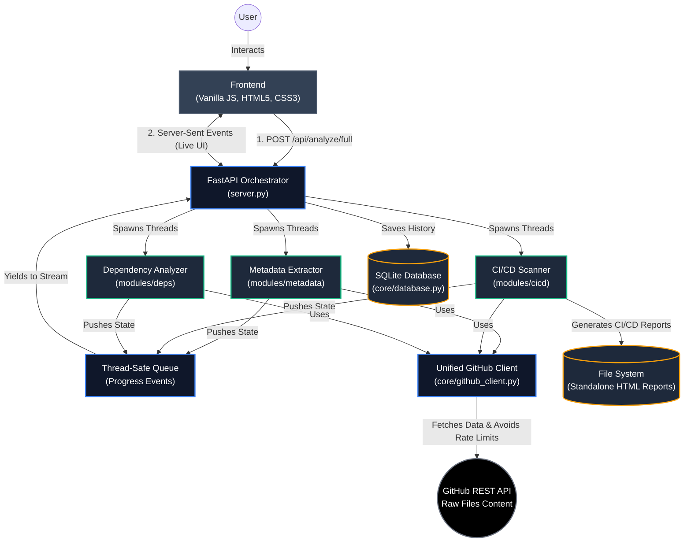

# GitHub Repository Intelligence System

## System Overview

The **GitHub Repository Intelligence Dashboard** is a high-performance, real-time analytics system designed to extract, analyze, and present comprehensive insights about GitHub repositories. 

It provides an "X-ray" view of any repository by analyzing three major domains concurrently:
1. **Repository Metadata**: Contributor activity, commit history, language metrics, and repository structure.
2. **CI/CD Pipelines**: Automatic detection, structural analysis, and security auditing of build and deployment pipelines (e.g., GitHub Actions, TeamCity, Drone).
3. **Dependency Health**: Package management analysis, license risk auditing, and version pinning hygiene (e.g., package.json, requirements.txt, go.mod).

---

## How It Works

The system is built on a **FastAPI** backend and a **Vanilla HTML/CSS/JS** frontend, communicating via **Server-Sent Events (SSE)** for real-time live updates.

1. **User Request**: The user submits a single repository (`owner/repo`) or a batch of repositories via the frontend.
2. **Orchestration**: The FastAPI orchestrator (`server.py`) receives the request. It spins up a thread-safe Queue and launches three parallel worker threads—one for each analysis module.
3. **Execution**:
   - The unified **GitHub Client** handles all API calls with built-in rate-limiting logic, automatic retries, and pagination optimization (using `per_page=1` header parsing to fetch massive repo totals efficiently).
   - Each module runs its specific extraction and analysis logic independently.
4. **Live Streaming**: As the modules run, they yield progress events into the Queue. The Orchestrator streams these events back to the frontend over an SSE connection, updating the UI dynamically.
5. **Persistence**: Once all modules complete, the aggregated data is merged and saved to an SQLite database (`AnalysisHistory`) for fast retrieval later.
6. **Presentation**: The frontend renders the unified JSON payload into rich, interactive dashboards containing metrics, gauges, file trees, and actionable security recommendations.

---

## Architecture Diagram

---

## Core System Components

### 1. Frontend Dashboard (`static/js/dashboard.js`)
- **Single Page Application (SPA)** built without heavy frameworks for maximum speed.
- Utilizes the **HTML5 History API** (`history.replaceState` and `popstate`) for smooth navigation between fresh searches and history views without page reloads.
- **SSE Consumer**: Uses the native `fetch` API and a `TextDecoder` to read chunks from the `text/event-stream`, translating backend progress events into live UI log entries and status spinners.

### 2. FastAPI Orchestrator (`server.py`)
- Acts as the central nervous system. 
- Exposes RESTful endpoints for starting analysis, fetching history, and checking API rate limits.
- Features a **heartbeat mechanism** to prevent long-running repository analyses from dropping connections via HTTP timeout.

### 3. Unified GitHub Client (`core/github_client.py`)
- Centralized requests layer handling authentication via `GITHUB_TOKEN`.
- Automatically catches `403/429` rate limit responses, calculates the reset wait time, and backs off gracefully.
- Employs a built-in LRU cache to ensure redundant requests (like fetching repo metadata multiple times across different modules) do not waste network bandwidth or API quota.

### 4. Modules

#### A. Metadata Extractor (`modules/metadata`)
- Scrapes overarching statistics.
- Safely paginates using `per_page=1` combined with GitHub's `Link` headers to extract exact totals for thousands of commits and contributors without exhausting the API limit.
- Generates a full repository file tree.

#### B. CI/CD Scanner (`modules/cicd`)
- Automatically detects pipeline files (`.github/workflows`, `.drone.yml`, etc.) across the repo tree.
- Uses `yaml` parsing to analyze triggers, jobs, and workflows.
- Contains a `security_checker` that evaluates pipelines against best practices (e.g., checking for unpinned actions, hardcoded secrets, excessive permissions) and assigns a Grade.
- Generates a downloadable, standalone HTML report for deep-dive analysis.

#### C. Dependency Analyzer (`modules/deps`)
- Parses dependency manifests across various ecosystems (`package.json`, `requirements.txt`, `go.mod`, `pom.xml`, etc.).
- Categorizes dependencies as direct/transitive and production/development.
- Calculates an overall **Dependency Health Score** based on pinning hygiene (e.g., exact versions vs unpinned `latest` tags) and identifies potential package risk levels.
